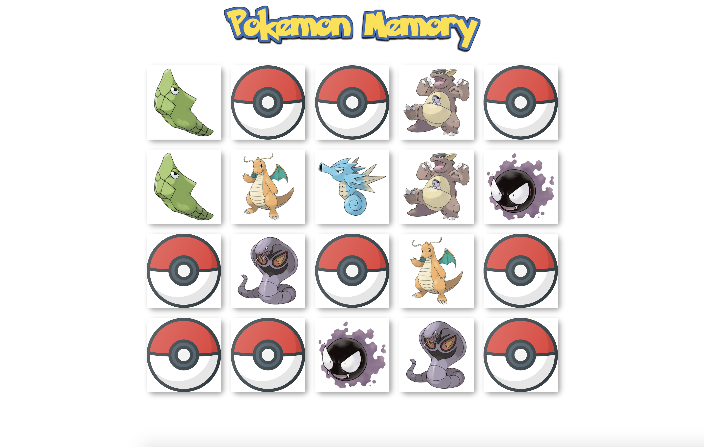

**Pokemon Memory** is a card game with Pokemon theme developed by Madylune. All cards are laid down on a surface and you have to flip each card. 
The object of the game is to turn over pairs of matching cards.

  

This project was bootstrapped with [Create React App](https://github.com/facebook/create-react-app).
